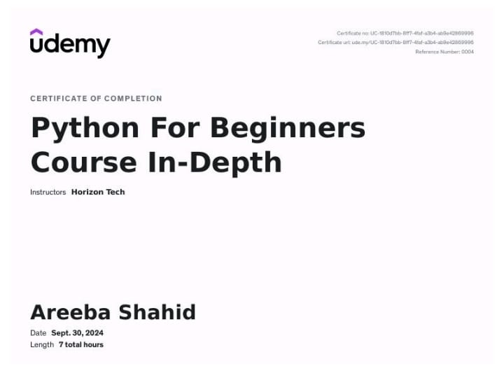

# Python For Beginners: Course In-Depth

## 🏆 Certificate of Completion
**Course:** Python For Beginners: Course In-Depth  
**Instructor:** Horizon Tech  
**Platform:** Udemy  
**Date Completed:** September 30, 2024  
**Duration:** 7 total hours  
**Certified To:** Areeba Shahid

---

## 🧠 What I Learned

This course provided a solid introduction to Python programming, covering:

- Basic syntax and variables
- Data types (strings, numbers, lists, dictionaries, etc.)
- Conditional statements and loops
- Functions and modules
- File handling
- Error handling (try/except)
- Basic object-oriented programming concepts
- Writing clean and readable code

---

## 🛠️ Tools & Technologies

- **Python 3**
- **VS Code / Jupyter Notebook**
- **Command Line Interface (CLI)**

---

## 📁 Repository Purpose

This repository is a showcase of my progress in learning Python through structured online education. It may include:

- Code snippets from exercises and assignments
- Notes and summaries of key concepts
- Beginner-level Python scripts and mini projects

---

## 🚀 Next Steps

Now that I’ve covered the fundamentals, I plan to dive deeper into:

- Intermediate Python (e.g., decorators, generators)
- Web development with Flask or Django
- Data analysis with Pandas and NumPy

---

## 📜 License

This repository is for educational and portfolio purposes only. All course content belongs to its respective creators.
